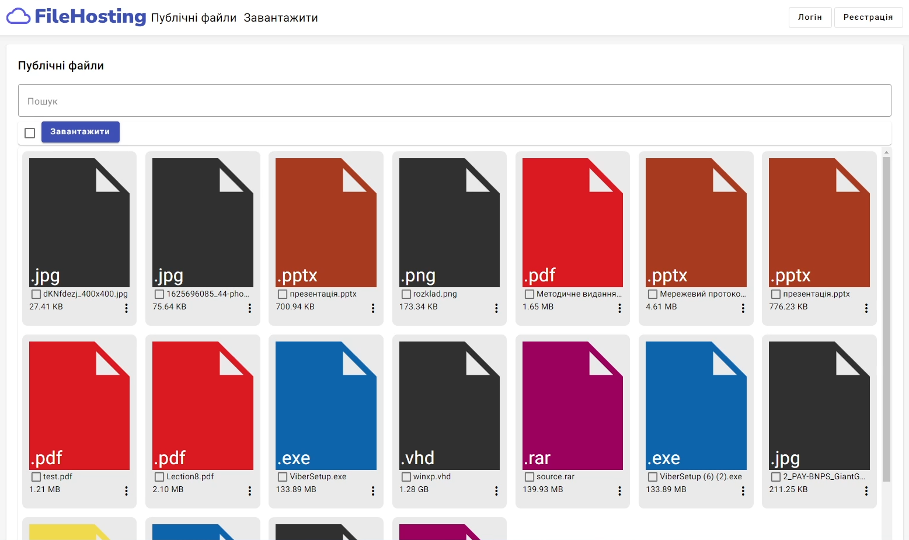
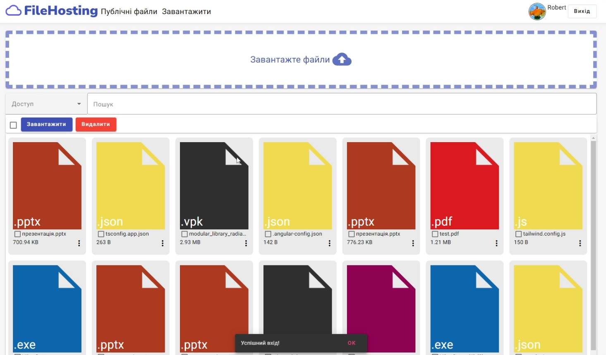
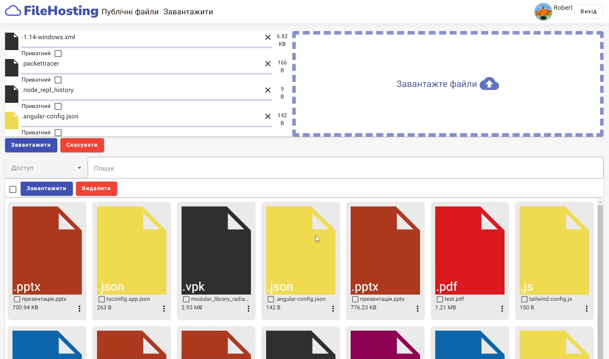
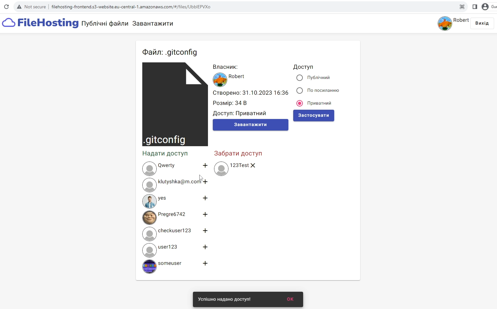
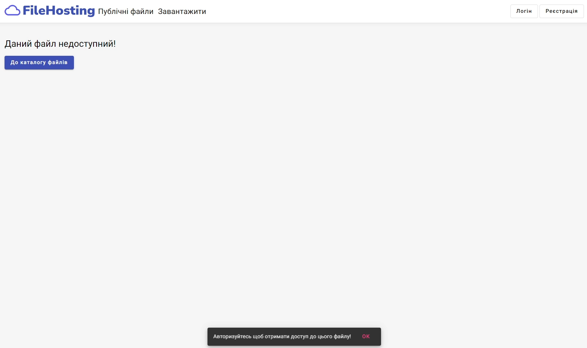

# FileStorage
3-rd year bachelors degree coursework

Interactive fullstack application which allows users to upload, download, store in a cloud and share files, adjust their privacy.

### Technoligies used:
- ASP.NET Web API
- Angular, HTML, CSS, Tailwind
- PostgreSQL, Entity Framework
- AWS EC2, S3, RDS, Github Actions

## Preview
### Public files page

### Own files and upload files page

### File Page

### File unaccessible error page
